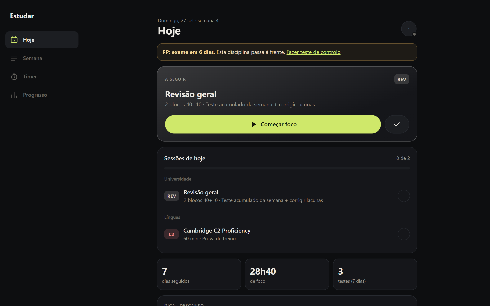
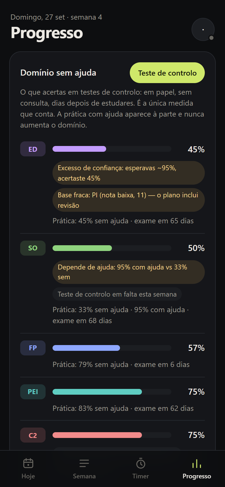
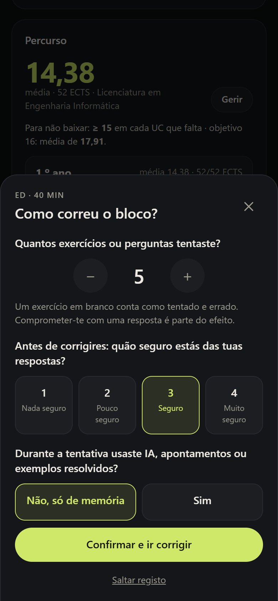
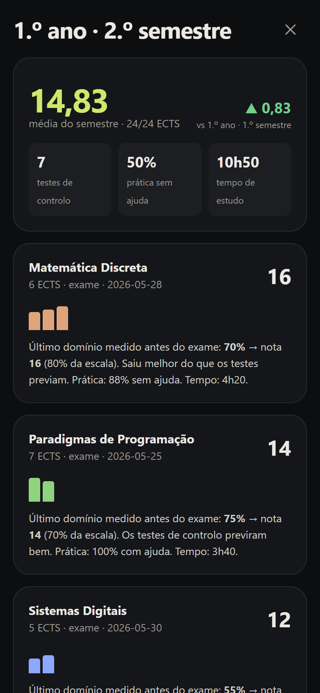
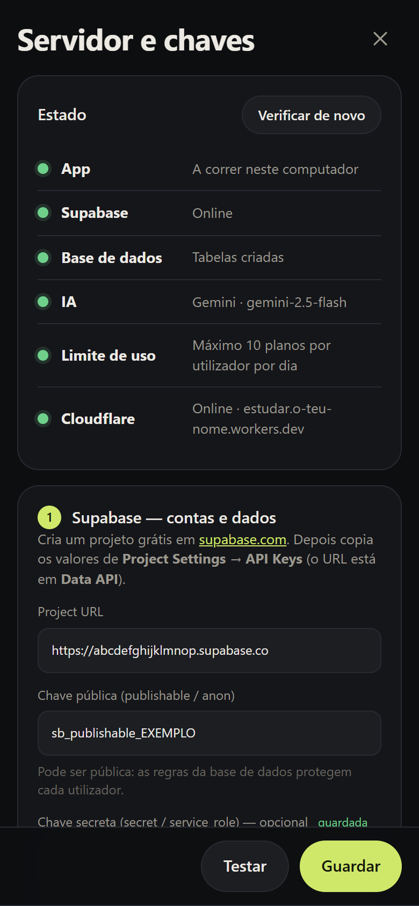

<div align="center">


# Estudar

**Estuda para lembrar no dia do exame — não só no dia em que estudas.**



[](LICENSE)
[](docs/funcionalidades/sincronizacao.md)
[](https://workers.cloudflare.com)
[](https://supabase.com)
[](docs/arquitetura/testes.md)

[Documentação](docs/) · [Começar](docs/guia/comecar.md) · [A ciência](docs/ciencia/index.md) · [Arquitetura](docs/arquitetura/index.md)

</div>

---

## O que é

Um sistema de estudo open source para o ensino superior. Organiza a semana com IA, guia cada sessão em blocos de foco e mede o que sabes **sem ajuda** — porque a investigação mostra que horas de estudo e desempenho durante a prática são maus sinais de aprendizagem (Roediger & Karpicke, 2006; Rohrer & Taylor, 2007; Bastani et al.).

## Funcionalidades

- **Plano semanal com IA** — a partir das disciplinas, datas e horas livres, com recuperação, espaçamento e intercalação; uma **verificação científica** fixa avisa o que ajustar. Gemini, Claude ou qualquer API compatível com OpenAI.
- **Modo foco** — blocos 40+10 em ecrã inteiro, ecrã sempre ligado, timer que sobrevive ao telemóvel fechar a app.
- **Registo do bloco** — tentativas, confiança e ajuda usada **antes** de corrigir; acertos depois.
- **Domínio sem ajuda** — só de testes de controlo em papel, sem consulta; prática com ajuda à parte, com aviso de dependência.
- **Calibração** — as disciplinas onde a confiança te engana sobem para o topo.
- **Percurso académico** — importação por foto, média por ECTS, nota para não baixar, provas com pesos e mínimos, recurso e época especial, pré-requisitos, relatório de semestre.
- **Configuração dentro da app** — chaves, tabelas e publicação no Cloudflare num ecrã, com um ponto de estado por serviço.
- **Sincronização e offline** — telemóvel ↔ computador em tempo real; PWA instalável; cópia de segurança em JSON.

<table>
  <tr>
    <td></td>
    <td></td>
    <td></td>
    <td></td>
  </tr>
</table>

## Início rápido

```bash
git clone https://github.com/RyanTech00/estudar.git
cd estudar
npm install
npm start          # abre http://localhost:8787
```

Na app: **Conta → Servidor e chaves** → cola o Supabase e a chave de IA → **Testar → Guardar** → **Ligar conta Cloudflare → Publicar**. Guia completo em [docs/guia/instalacao.md](docs/guia/instalacao.md).

Sem configurar nada, a app já funciona em modo local (dados só no browser).

## Como está feito

| Peça | Tecnologia |
|---|---|
| App | PWA sem build — HTML, CSS, ES modules (`public/`) |
| Servidor | Um Cloudflare Worker serve a app e a API; `npm start` corre a mesma API localmente |
| Dados | Supabase: login por código no email, um documento JSON por utilizador com RLS, Realtime |
| IA | Configurável; a chave só existe no servidor |
| Regras | `learning.js` e `curriculum.js`, funções puras com testes verificados por mutação |

Mais em [Arquitetura](docs/arquitetura/index.md) e [Modelo de dados](docs/arquitetura/dados.md).

## Desenvolvimento

```bash
npm start            # app + API + ecrã de configuração
npm test             # regras de aprendizagem e do percurso
npm run check        # build do Worker sem publicar

cd docs
npm install
npm run dev          # site de documentação
npm run screenshots  # regenera as capturas com um estudante fictício
npm run build        # compila e verifica links e âncoras
```

## Contribuir

Issues e pull requests são bem-vindos — vê o [guia de contribuição](CONTRIBUTING.md). Antes de mexer numa regra de aprendizagem, lê [os princípios](docs/ciencia/index.md): são invariantes, e cada uma tem testes.

## Licença

[MIT](LICENSE) © 2026 Ryan Barbosa
