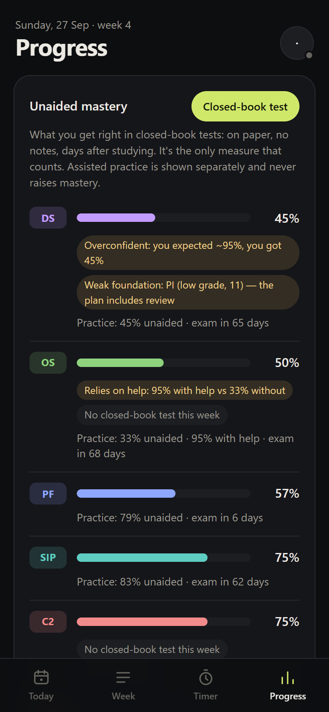
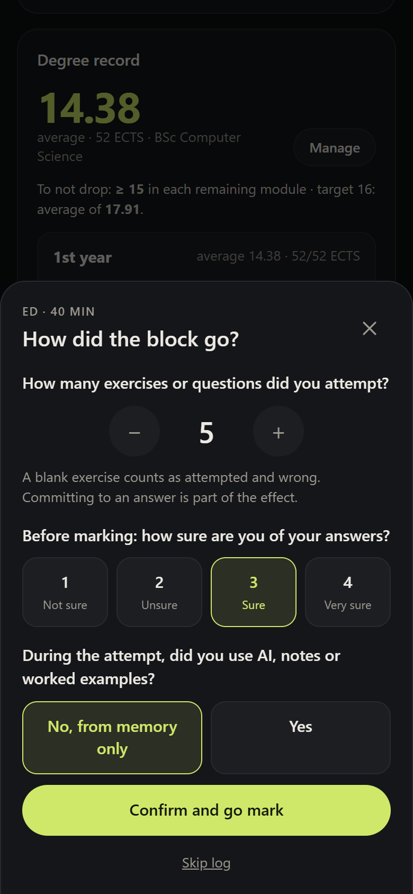
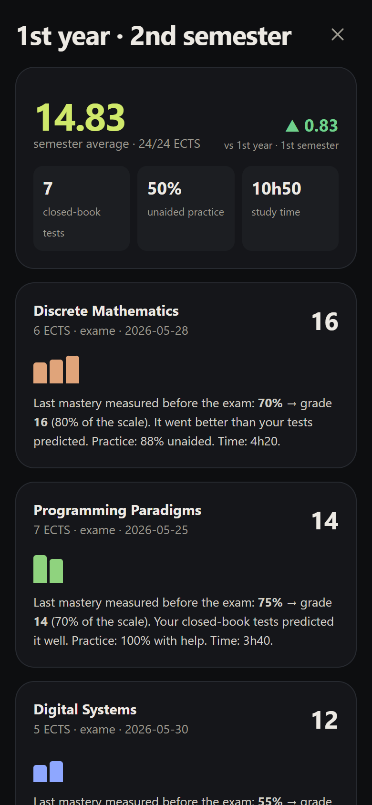
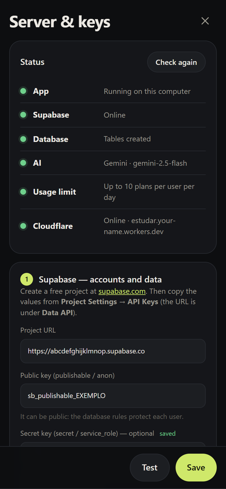

<div align="center">


# Estudar

**English** · [Português](README.pt-PT.md)

**Study to remember on exam day — not just on the day you study.**


[](https://www.npmjs.com/package/estudar)
[](LICENSE)
[](docs/en/features/sync.md)
[](https://workers.cloudflare.com)
[](https://supabase.com)
[](docs/en/architecture/tests.md)
[](https://deepwiki.com/RyanTech00/estudar)

<a href="https://www.buymeacoffee.com/ryanbarbosa"></a>

[Documentation](docs/en/) · [Get started](docs/en/guide/getting-started.md) · [The science](docs/en/science/index.md) · [Architecture](docs/en/architecture/index.md)

</div>

---

## What it is

An open-source study system for university students. It plans your week with AI, guides each session in focus blocks and measures what you know **unaided** — because research shows that hours studied and performance during practice are poor signals of learning (Roediger & Karpicke, 2006; Rohrer & Taylor, 2007; Bastani et al.).

## Features

- **AI weekly plan** — built from your subjects, exam dates and free hours, around retrieval, spacing and interleaving; a fixed **scientific check** flags what to adjust. Gemini, Claude or any OpenAI-compatible API.
- **Focus mode** — full-screen 40+10 blocks, screen kept awake, a timer that survives the phone killing the app.
- **Block log** — attempts, confidence and help used are recorded **before** checking; the score comes after.
- **Unaided mastery** — only from closed-book tests on paper; assisted practice is shown separately, with a reliance-on-help warning.
- **Calibration** — subjects where your confidence fools you rise to the top.
- **Degree record** — curriculum import from a photo, ECTS-weighted average, the grade you need to keep it, weighted assessments with minimum grades, resits and special exam periods, prerequisites, semester report.
- **In-app setup** — keys, database tables and publishing to Cloudflare from one screen, with a status dot per service.
- **Sync and offline** — phone ↔ computer in real time; installable PWA; JSON backup.
- **English and Portuguese** — interface, server messages and AI plans in the language you choose (**Account → Language**).

<table>
  <tr>
    <td></td>
    <td></td>
    <td></td>
    <td></td>
  </tr>
</table>

## Quick start

```bash
npx estudar        # opens http://localhost:8787 (needs Node.js 20+)
```

In the app: **Account → Server & keys** → paste your Supabase details and AI key → **Test → Save** → **Connect Cloudflare account → Publish**. Keys are stored in `~/.estudar`. Full guide in [docs/en/guide/installation.md](docs/en/guide/installation.md).

With nothing configured, the app already works in local mode (data stays in the browser).

## How it's built

| Part | Technology |
|---|---|
| App | PWA with no build step — HTML, CSS, ES modules (`public/`) |
| Server | One Cloudflare Worker serves the app and the API; `npm start` runs the same API locally |
| Data | Supabase: sign-in with an emailed code, one JSON document per user with RLS, Realtime |
| AI | Configurable; the key only ever lives on the server |
| Rules | `learning.js` and `curriculum.js`, pure functions with mutation-verified tests |
| Languages | `i18n.js` + one dictionary per language; a test fails if any string is untranslated |

More in [Architecture](docs/en/architecture/index.md) and [Data model](docs/en/architecture/data.md).

## Development

```bash
git clone https://github.com/RyanTech00/estudar.git
cd estudar
npm install

npm start            # app + API + setup screen
npm test             # learning, degree-record and translation rules
npm run check        # build the Worker without publishing

cd docs
npm install
npm run dev          # documentation site
npm run screenshots  # regenerate screenshots (both languages) with a fictional student
npm run build        # build and check links and anchors
```

## Contributing

Issues and pull requests are welcome — see the [contributing guide](CONTRIBUTING.md). Before changing a learning rule, read [the principles](docs/en/science/index.md): they are invariants, and each one has tests.

## Support

Estudar is free and will stay free. If it saved you time — or a module — a coffee helps keep it going.

<a href="https://www.buymeacoffee.com/ryanbarbosa"></a>


## Star History

<a href="https://www.star-history.com/?repos=ryantech00%2Festudar&type=date&legend=top-left">
 <picture>
   <source media="(prefers-color-scheme: dark)" srcset="https://api.star-history.com/chart?repos=ryantech00/estudar&type=date&theme=dark&legend=top-left" />
   <source media="(prefers-color-scheme: light)" srcset="https://api.star-history.com/chart?repos=ryantech00/estudar&type=date&legend=top-left" />
   
 </picture>
</a>

## License

[MIT](LICENSE) © 2026 Ryan Barbosa

<sub>Co-Authored-By: Claude Opus 5.5</sub>
